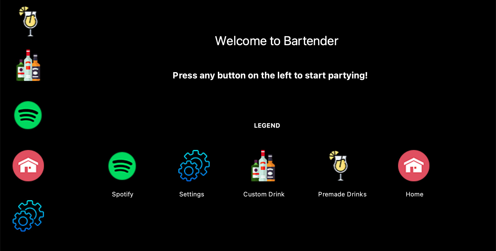
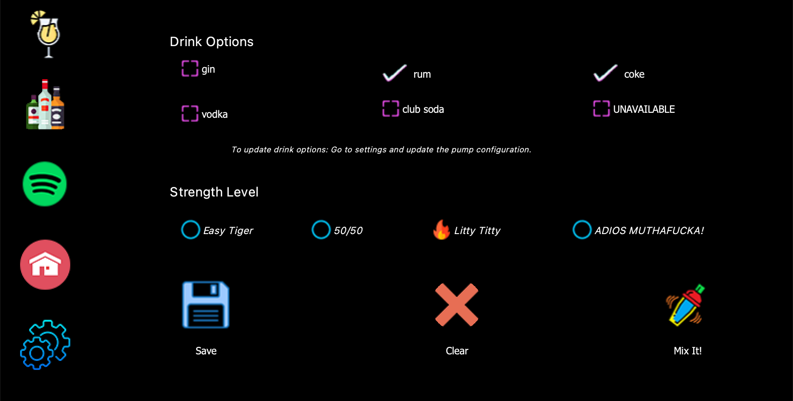
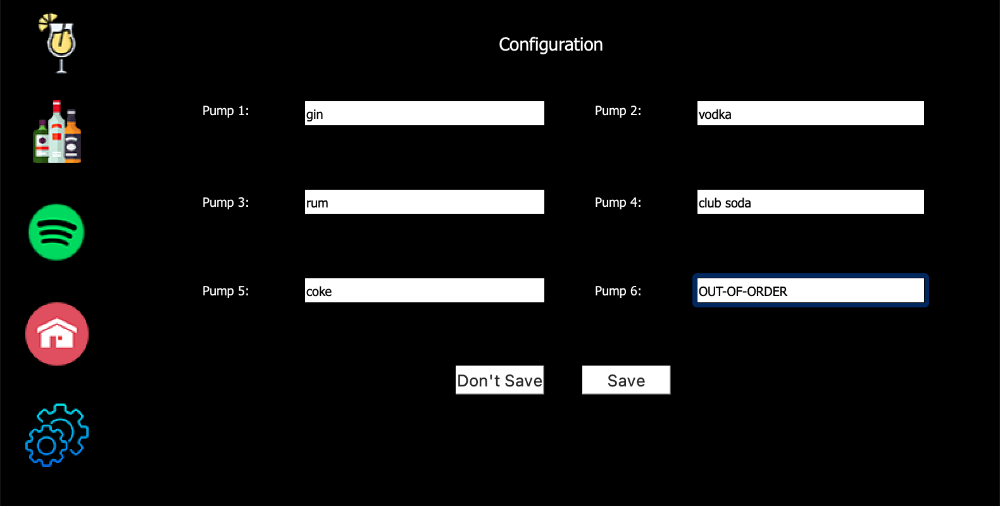
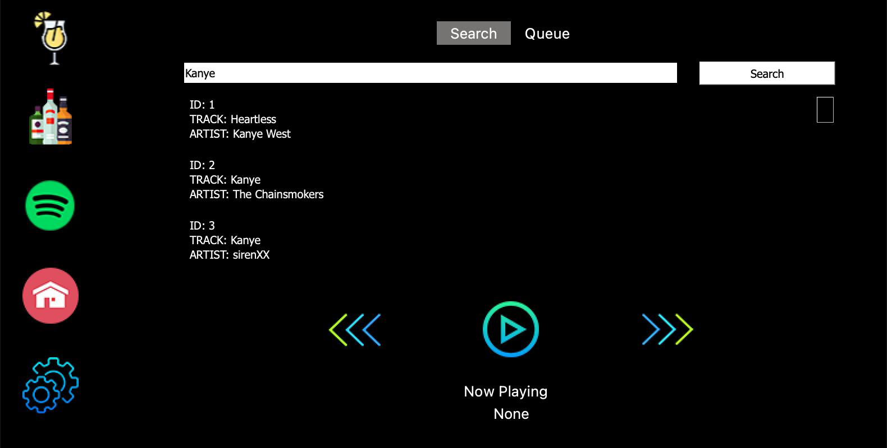

# Table of Contants

- [Table of Contants](#table-of-contants)
- [Bartender](#bartender)
- [Bartender UI](#bartender-ui)
- [Spotify](#spotify)
- [My Hardware](#my-hardware)
- [Common Hardware](#common-hardware)
- [3D Prints](#3d-prints)
- [Software Dependencies](#software-dependencies)
    - [On the Raspberry Pi only](#on-the-raspberry-pi-only)
- [Launching Bartender](#launching-bartender)
- [Bartender Simulation](#bartender-simulation)

---

# Bartender

Short story... I was hired right out of college as an Embedded Software Engineer lacking **A LOT** of knowledge about writing software to interact with hardware. Through a lot of on the job training, I got comfortable in this field and have found a love for it. I got an idea one day for a Bartender project because I wanted do something with my Raspberry PI's I have received at Hackathons and wanted to deep dive and experiment in the world of Electrical Computer Engineering (ECE) to help strengthen my skill.

After doing some research I found this project by [hackster.io](https://www.hackster.io/hackershack/smart-bartender-5c430e) that I have used as the hardware template for my Bartender. Their [YouTube tutorial](https://youtu.be/2DopvpNF7J4) and documentation helped a lot to build the base.

---

# Bartender UI

After using the Bartender for a few months I decided to give it a little make over. Here is the new UI design of the Bartender with the introduction of [Spotify](#spotify)!

---

# Spotify

Using the [Spotify Python API](https://spotipy.readthedocs.io/en/2.19.0/), Bartender is now equiped to play on your Alexa "every where" speaker group! It has the ability to control play back, as well as a general search and queue up songs.

---

# My Hardware

I used majority of the hardware listed in the link above. There are a few differences, I have listed them below.

- [Raspberry Pi 4 Model B](https://www.amazon.com/gp/product/B07YRSYR3M/ref=ppx_yo_dt_b_asin_title_o04_s00?ie=UTF8&psc=1)

- [Raspberry Pi 7" Touch Screen Display](https://www.amazon.com/gp/product/B0153R2A9I/ref=ppx_yo_dt_b_asin_title_o06_s00?ie=UTF8&psc=1)

I found issues with the step down motor that was used in the template, so I purchased the following one instead.

- [DROK Step Down Motor](https://www.amazon.com/gp/product/B013UIMNMQ/ref=ppx_yo_dt_b_asin_title_o03_s00?ie=UTF8&psc=1)

I could not find jumper wires long enough so I just went down to my local ACE Hardware and got Red and Black Copper. **_It is important that you get that you get 18-16 gauge wire. Anything bigger will not fit into the Power Relay and Power Distribution boards_**

I did not add LED lights to the bartender because I added the 7" Touchscreen and did not have enough 5V GPIO pins to support. But here is a link to the LED lights I originally bought.

- [LED Lights](https://www.amazon.com/gp/product/B00XQN3AF0/ref=ppx_yo_dt_b_asin_title_o08_s00?ie=UTF8&psc=1)

---

# Common Hardware

- [Power Relay Module](https://www.amazon.com/gp/product/B00KTELP3I/ref=ppx_od_dt_b_asin_title_s02?ie=UTF8&psc=1)

- [Power Distribution Board](https://www.amazon.com/gp/product/B01CU66VM2/ref=ppx_od_dt_b_asin_title_s03?ie=UTF8&psc=1)

- [Power Supply](https://www.amazon.com/gp/product/B01E6RMASC/ref=ppx_od_dt_b_asin_title_s02?ie=UTF8&psc=1)

- [Power Cable](https://www.amazon.com/gp/product/B00005113L/ref=ppx_od_dt_b_asin_title_s02?ie=UTF8&psc=1)

- [(6) 12V Dosing Pumps](https://www.amazon.com/gp/product/B01IUVHB8E/ref=ppx_od_dt_b_asin_title_s02?ie=UTF8&psc=1)

- [Diodes](https://www.amazon.com/gp/product/B00W17LOBO/ref=ppx_od_dt_b_asin_title_s03?ie=UTF8&psc=1)

- [Food Grade Silicon Tubing](https://www.amazon.com/gp/product/B08BRB2LXX/ref=ppx_od_dt_b_asin_title_s03?ie=UTF8&psc=1)

  - I recommend getting 2 orders of the silicon tubing, because your tubing lengths may vary.

- [Beginner Soldering Kit](https://www.amazon.com/gp/product/B06XZ31W3M/ref=ppx_od_dt_b_asin_title_s03?ie=UTF8&psc=1)

  - I purchased a [Helping Hands Soldering Stand](https://www.amazon.com/gp/product/B085Z8JF7D/ref=ppx_yo_dt_b_asin_title_o00_s00?ie=UTF8&psc=1) because I have never soldered before and found it very frustrating to hold on to everything and be accurate. This stand helped a lot holding everything in place.

---

# 3D Prints

I used all the 3D printed parts listed on [Pateon](https://www.patreon.com/posts/smart-bartender-37735749) except for the items needed for the LED front panel.

I used Tinkercad to create a [7" Touchscreen Mount](https://www.tinkercad.com/things/ieYN527b6Uu). The legs to the mount are not long enough, but that was my first 3D print design and it still works.

.stl files can be found in _assets/documents_ folder.

**Big shoutout to my buddy Michael Kubiak for printing all the parts for the Bartender!**

---

# Software Dependencies

- [Python v3.6+](https://www.python.org/downloads/)

The following packages are in [requirements.txt](requirements.txt).

- [PyQt5](https://pypi.org/project/PyQt5/)

- [PyQt5 Designer](https://pypi.org/project/PyQt5Designer/)

- [GPIO Zero](https://gpiozero.readthedocs.io/en/stable/)

- [pytest](https://pypi.org/project/pytest/)

- [pytest-qt](https://pypi.org/project/pytest-qt/)

> To install packages run: `pip3 install -r requirements.txt`

### On the Raspberry Pi only

- [RPi.GPIO](https://pypi.org/project/RPi.GPIO/)

  > python3 -m pip install RPi.GPIO

  This package is unsupported on Mac and Windows systems.
  May already be installed on raspberry pi.

  You can uncomment RPi.GPIO in the requirements.txt on
  Raspberry Pi to complete the full installation.

---

# Launching Bartender

To launch the Bartender application, cd into the bartender directory and run:

> Windows
>
> > python main.py
>
> Mac/Linux
>
> > python3 main.py

For executing on the touchscreen, drag and drop the bartender.sh file to the desktop and double tab to execute. You will be prompted to how to execute, select _Execute in Terminal_. This will launch the application from the terminal and will provide console output for debugging if needed.

---

# Bartender Simulation

The sim environment is there to execute the Bartender functionality without talking to hardware. This means the you can run and test your code on different platforms without needing the GPIO interface. The GPIO interface will be simulated and will pretend to execute for the same duration as it would when being executed for real.

To launch the Bartender application in the sim enviroment, cd into the bartender directory and run:

> Windows
>
> > python main.py --sim
>
> Mac/Linux
>
> > python3 main.py --sim